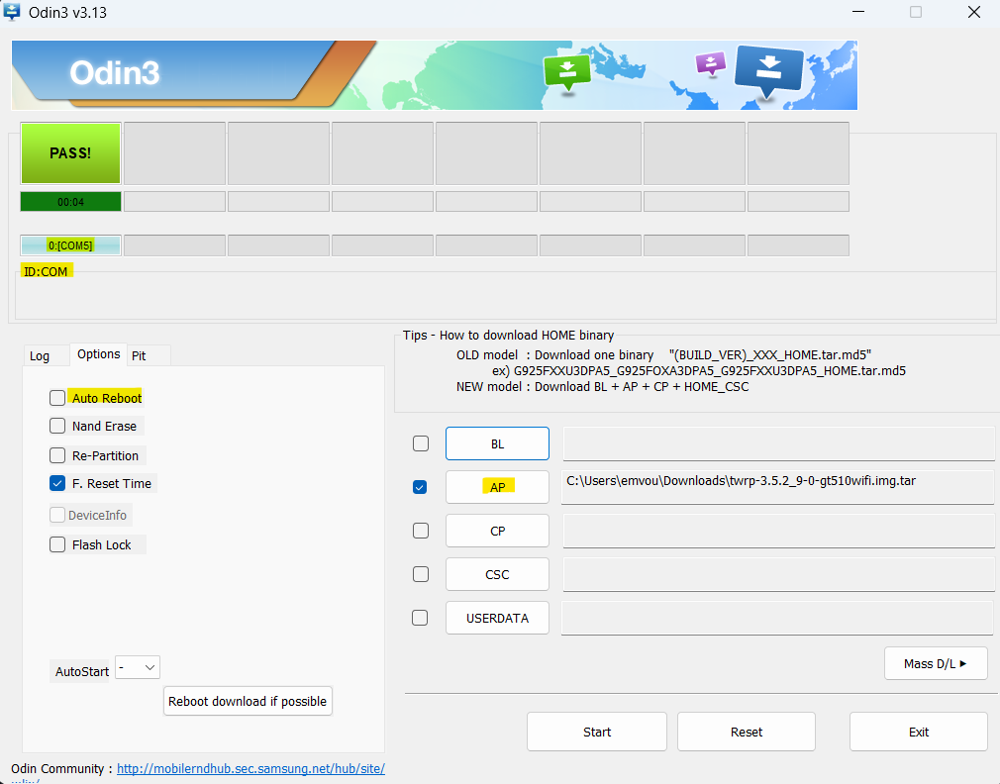

# SM-T550-LineageOS-16-Installation-Guide
Ce dépôt documente la procédure complète pour redonner vie à une tablette **Samsung SM-T550** en passant d'un système Android 6 obsolète à une version fluide et moderne d'**Android 9.0 (LineageOS 16.0)**.

---

## 📋 Sommaire
1. [Présentation](#-présentation)
2. [Prérequis](#-prérequis)
3. [Étape 1 : Configuration d'Odin & Recovery](#-étape-1--configuration-dodin--recovery)
4. [Étape 2 : Nettoyage du Système (Wipe)](#-étape-2--nettoyage-du-système-wipe)
5. [Étape 3 : Flash de la ROM et des GApps](#-étape-3--flash-de-la-rom-et-des-gapps)
6. [Post-Installation & Astuces](#-post-installation--astuces)

---

## 📖 Présentation
La **Samsung Galaxy Tab A 9.7 (2015)** est une tablette robuste mais limitée par son logiciel d'origine. Ce guide permet de :
* Installer **TWRP** (Custom Recovery).
* Passer sous **LineageOS 16.0** (Android 9.0).
* Rendre la tablette compatible avec les applications actuelles (YouTube, Netflix, etc.).

---

## 🛠 Prérequis

### Matériel
* **Tablette :** Samsung SM-T550 (gt510wifi).
* **Câble :** USB vers Micro-USB (transfert de données).
* **PC :** Windows 10/11.

### Logiciels & Fichiers
| Type | Fichier | Rôle |
| :--- | :--- | :--- |
| **PC** | [Odin v3.14.4](https://odindownload.com/) | Logiciel de flash Samsung |
| **PC** | [TWRP .tar](https://twrp.me/) | Recovery pour installer les ZIP |
| **Tablet** | [LineageOS 16.0 .zip](https://androidfilehost.com/) | Le nouveau système Android 9 |
| **Tablet** | [OpenGApps ARM 9.0 .zip](https://opengapps.org/) | Play Store et Services Google |

---

## ⚡ Étape 1 : Configuration d'Odin & Recovery

1.  **Mode Download :** Éteignez la tablette. Maintenez `Volume Bas + Home + Power`. Confirmez avec `Volume Haut`.
2.  **Odin :** Lancez Odin en administrateur. Branchez la tablette (la case `ID:COM` doit devenir bleue).
3.  **Paramétrage :**
    * Cliquez sur **AP** et sélectionnez votre fichier `twrp_xxx.tar`.
    * **CRUCIAL :** Dans l'onglet **Options**, décochez **Auto Reboot**.
4.  **Flash :** Cliquez sur **Start**. Une fois "PASS" affiché, débranchez la tablette.
    

---

## 🧹 Étape 2 : Nettoyage du Système (Wipe)

1.  **Accès TWRP :** Forcez l'arrêt (`Volume Bas + Power`) puis maintenez immédiatement `Volume Haut + Home + Power`.
2.  **Wipe :** Allez dans **Wipe** > **Advanced Wipe**.
3.  **Sélection :** Cochez `Dalvik / Art Cache`, `System`, `Data`, `Cache`.
4.  **Validation :** Faites glisser pour confirmer le nettoyage.

---

## 📦 Étape 3 : Flash de la ROM et des GApps

1.  **Transfert :** Tablette toujours sur TWRP et branchée au PC, copiez les fichiers `.zip` (LineageOS et GApps) dans le stockage interne.
2.  **Installation :**
    * Sur la tablette, allez dans **Install**.
    * Sélectionnez le fichier **LineageOS**.
    * Appuyez sur **Add more Zips** et sélectionnez le fichier **GApps**.
3.  **Flash :** Faites glisser la barre bleue pour lancer l'installation.
4.  **Reboot :** Une fois fini, faites **Reboot System** (cliquez sur "Do Not Install" pour l'app TWRP).

---

## 💡 Post-Installation & Astuces

### 🛠 Erreur au démarrage
Si le message *"Speech Services by Google keeps stopping"* apparaît, ignorez-le. Connectez le Wi-Fi et laissez le Play Store faire ses mises à jour, le bug disparaîtra seul.

### 🎬 Netflix / Disney+ / Apps bancaires
Si le Play Store indique que l'appareil n'est pas compatible :
1.  Téléchargez l'APK sur **APKMirror**.
2.  Autorisez les sources inconnues dans les paramètres.
3.  Installez l'APK manuellement.

---

> **Note Stoïcienne :** La patience est la clé du succès technique. Si un obstacle survient, ne vous troublez pas, reprenez les étapes avec calme.
